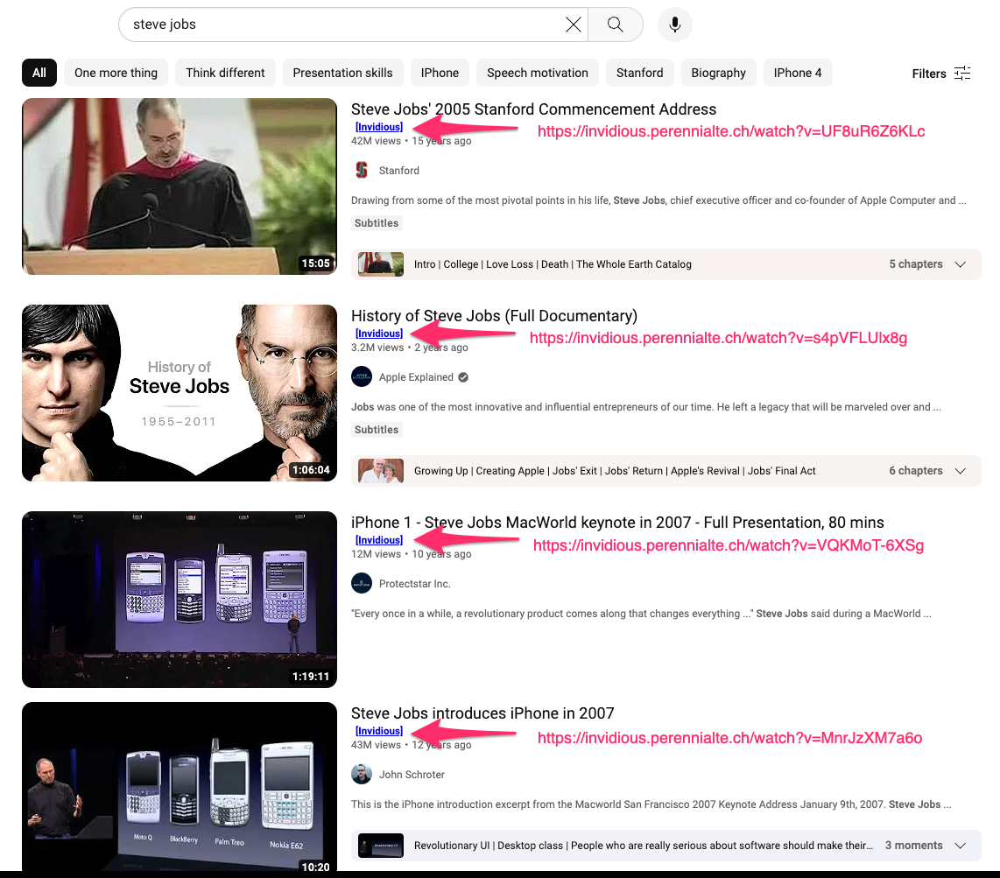

# invidious-linker

Chrome extension to provide links to the youtube video hosted on 'invidious' for convenient ad-free viewing.

### Example

Youtube search results for 'steve jobs'. Note the links to the same content on invidious:

```none
https://invidious.perennialte.ch/watch?v=UF8uR6Z6KLc
https://invidious.perennialte.ch/watch?v=Hd_ptbiPoXM
https://invidious.perennialte.ch/watch?v=MnrJzXM7a6o
https://invidious.perennialte.ch/watch?v=f60dheI4ARg
```




# Installation

1. Clone this repo
2. Open Google Chrome
3. Place this in the address bar and hit enter: `chrome://extensions/`
4. Ensure 'Developer Mode' is on (top right)
5. Click 'Load unpacked' (top left)
6. Navigate to root directory of this repo, click 'Select'
7. The extension should now be working
8. Go to the youtube home page or youtube search results page and invidious-linker will place a link near the title of each video


